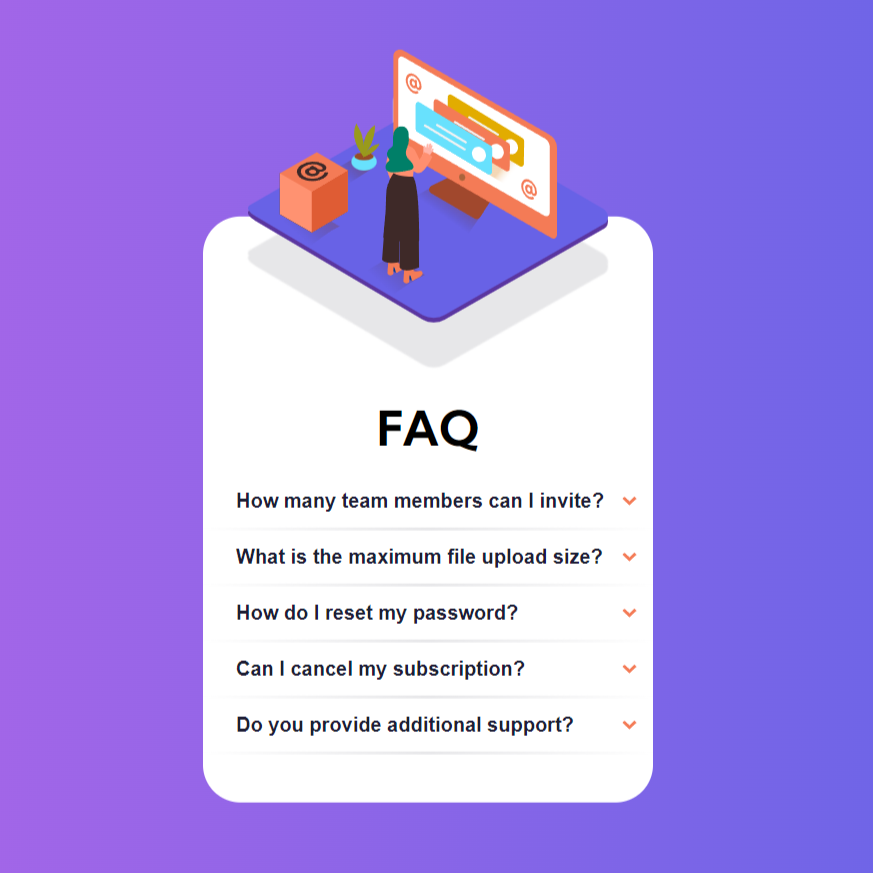

# Frontend Mentor - FAQ accordion card solution

## Table of contents

- [Overview](#overview)
  - [The challenge](#the-challenge)
  - [Screenshot](#screenshot)
  - [Links](#links)
- [My process](#my-process)
  - [Built with](#built-with)
  - [What I learned](#what-i-learned)
  - [Useful resources](#useful-resources)
- [Author](#author)

## Overview

### The challenge

Users should be able to:

- View the optimal layout for the component depending on their device's screen size
- See hover states for all interactive elements on the page
- Hide/Show the answer to a question when the question is clicked

### Screenshot

### Links

- Solution URL: [FAQ Accordion Card](https://nablanco.github.io/FAQ-accordion-card/pages/index.html)

## My process

### Built with

- Semantic HTML5 markup
- CSS custom properties
- Flexbox
- Javascript

### What I learned

The crux of this project was centered around the functionality of the buttons. To ensure a satisfying user experience, the the response to each question is only shown when the user clicks on the button. Additionaly, if any other response is shown when click anther question, that first response is closed. This was solved by storing the state of every button.

## Author

- Website - https://nicholasblanco.com/ 
- Frontend Mentor - https://www.frontendmentor.io/profile/nablanco